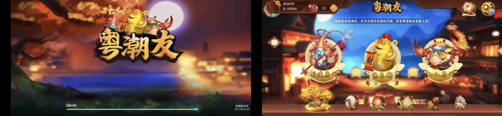
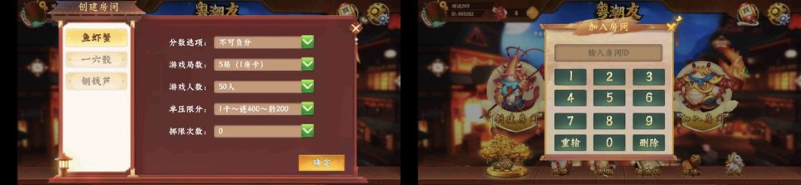
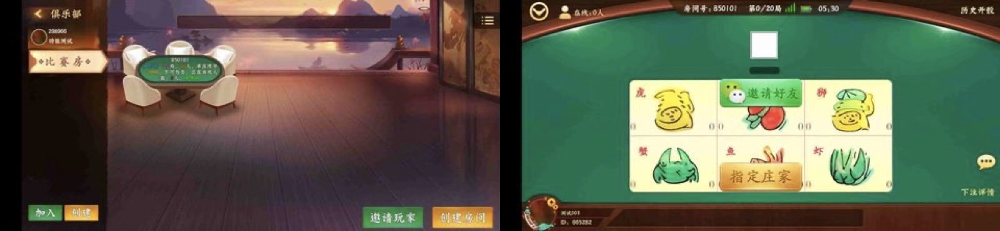
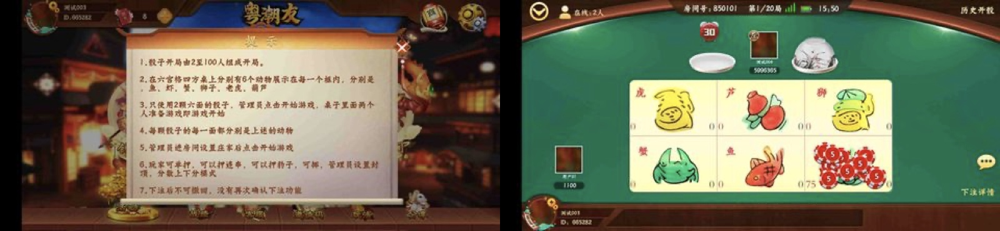
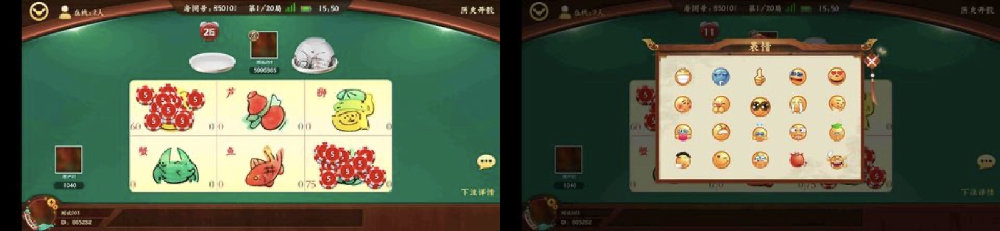
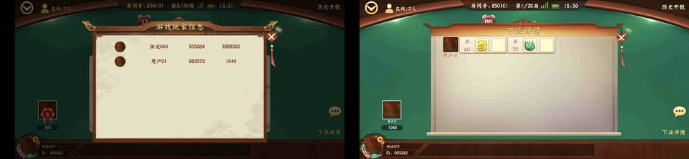
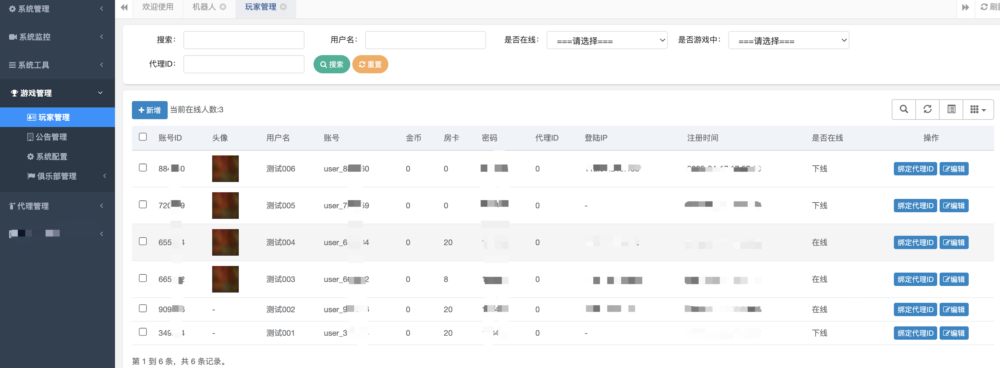
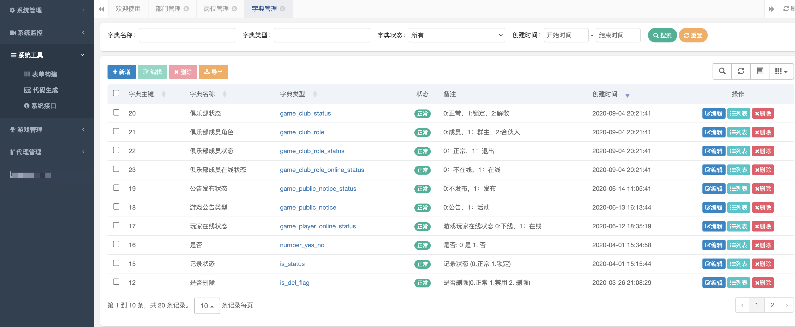
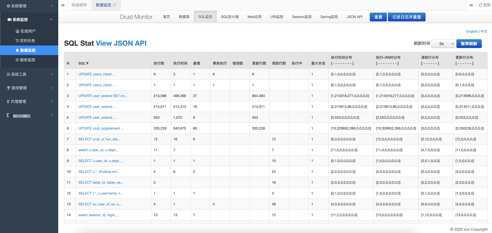
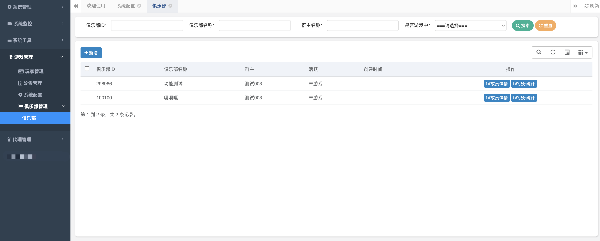

## 鱼虾蟹源码 稳定运行 2025全新源码 房卡 全网首发
> 游戏介绍：
> 鱼虾蟹源码，APP，Android + Ios，源码提供，支持定制
**技术栈：Unity3D，Java，Scala，Vue等**
前端使用Unity3D作为开发引擎，区别市面的白鹭/cocos2d，服务器采用Java为主要开发语言，Scala为辅助多线程处理，后台使用vue进行研发，目前代码稳定运行，支持定制或源码

需要请联系Telegram：[点我联系](https://t.me/beauliuLsVeM526)

1. App客户端
前端使用Unity3D为开发引擎，ILruntime技术支持热更新
部分功能图片如下：

2. 管理后台
后台使用Springboot提供接口服务，Vue作为后台界面框架
部分功能图片如下：

